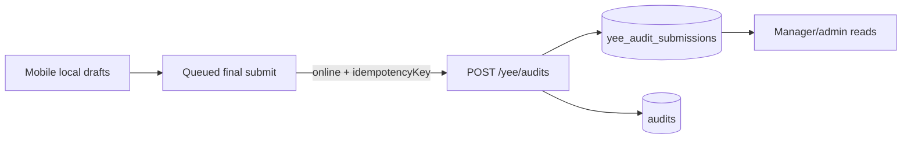
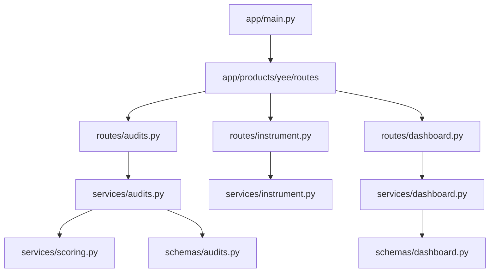

# YEE Offline-Safe Backend Catch-up

> Status note: Phase 2 module extraction has partially landed. `app/products/yee/`
> exists with `routes/{audits,instrument,dashboard}.py`, and `app/yee_router.py` no
> longer exists. The `todos` in the frontmatter above are the original plan state
> and have not been re-verified item by item. For the current backend shape see
> `docs/architecture.md` and `docs/client-map.md`.

**Goal:** Make YEE reliably offline-safe for the chosen mobile model: drafts stay local on the device, same-device recovery is enough, and the backend only needs to be durable at final submit time.

**Recommended architecture:**

- Keep YEE drafts local to the mobile app. The backend should not grow into a server-draft-sync system for YEE right now.
- Harden only the final-submit boundary first. Add idempotent replay for `POST /yee/audits`, protect against duplicate submission rows at the database level, and keep JSONB response storage in [audit-tools-backend/app/models.py](audit-tools-backend/app/models.py).
- Keep the shared `Audit` shell for compatibility with current manager/admin reads in [audit-tools-backend/app/dashboard_router.py](audit-tools-backend/app/dashboard_router.py), but do not deepen the server-side draft model in [audit-tools-backend/app/yee_router.py](audit-tools-backend/app/yee_router.py).
- Do **not** copy Playspace’s normalized answer tables or execution-mode logic. Those belong to Playspace’s product complexity, not YEE’s current requirements.
- Defer Playspace-style `submit-intent` and stalled-submission monitoring. With local-only drafts and no cross-device resume, the highest-value durability boundary is idempotent final submit, not server-visible pre-submit state.

## Phase 1: Offline Durability First

This phase is **sequential** and should land before any structural refactor because it changes one shared contract across models, migrations, routes, and tests.

- Add focused failing YEE durability tests modeled after [audit-tools-backend/tests/products/playspace/test_submit_durability.py](audit-tools-backend/tests/products/playspace/test_submit_durability.py), but scoped to YEE’s simpler final-submit flow.
- Create a new YEE test file such as [audit-tools-backend/tests/products/yee/test_submit_durability.py](audit-tools-backend/tests/products/yee/test_submit_durability.py) instead of overloading [audit-tools-backend/tests/products/yee/test_yee_routes.py](audit-tools-backend/tests/products/yee/test_yee_routes.py).
- Extend `YeeAuditSubmission` in [audit-tools-backend/app/models.py](audit-tools-backend/app/models.py) with a nullable `submit_idempotency_key` and add a product migration after [audit-tools-backend/alembic/versions/yee_0003_manager_profile_rules.py](audit-tools-backend/alembic/versions/yee_0003_manager_profile_rules.py).
- Add a database-level uniqueness guarantee for one submitted YEE audit per `(auditor_id, place_id)` so duplicate submits cannot create multiple rows under race or retry conditions.
- Extend the submit payload in [audit-tools-backend/app/yee_router.py](audit-tools-backend/app/yee_router.py) with an optional idempotency key. On first success, store the key. On replay with the same key, return the already-submitted record instead of a `409`. On replay with a different key or no key, keep the current protective conflict behavior.
- Preserve existing reads used by [audit-tools-backend/app/dashboard_router.py](audit-tools-backend/app/dashboard_router.py) and `GET /yee/places/{place_id}/audit-state` so the durability change does not break manager/admin visibility.

**Phase 1 deliverables:**

1. **Characterization tests first**
   - Create [audit-tools-backend/tests/products/yee/test_submit_durability.py](audit-tools-backend/tests/products/yee/test_submit_durability.py)
   - Cover:
     - first submit succeeds and persists exactly one row
     - replay with same idempotency key returns the existing submission
     - replay with different key still conflicts
     - duplicate submissions cannot create multiple `yee_audit_submissions` rows
     - current dashboard/audit-state reads still work after submit
2. **Schema hardening**
   - Modify [audit-tools-backend/app/models.py](audit-tools-backend/app/models.py)
   - Add a new YEE migration after [audit-tools-backend/alembic/versions/yee_0003_manager_profile_rules.py](audit-tools-backend/alembic/versions/yee_0003_manager_profile_rules.py)
3. **Route contract update**
   - Extend `POST /yee/audits` in [audit-tools-backend/app/yee_router.py](audit-tools-backend/app/yee_router.py) to accept and persist the idempotency key
4. **Regression verification**
   - Re-run YEE route tests and any dashboard-adjacent tests touching YEE reads before phase 2 begins

## Target YEE Module Shape

The architecture refactor should aim for this structure under [audit-tools-backend/app/products/yee/](audit-tools-backend/app/products/yee/):

- `routes/__init__.py` — compose all YEE product routers
- `routes/audits.py` — auditor-facing audit lifecycle endpoints currently in [audit-tools-backend/app/yee_router.py](audit-tools-backend/app/yee_router.py)
- `routes/instrument.py` — YEE instrument fetch and admin instrument version endpoints
- `routes/dashboard.py` — YEE-only manager/admin route handlers that can move out of [audit-tools-backend/app/dashboard_router.py](audit-tools-backend/app/dashboard_router.py)
- `services/audits.py` — assignment checks, draft lookup, final submit, idempotent replay, state response building
- `services/instrument.py` — active instrument lookup, bootstrap, version activation/deletion, site copy handling
- `services/dashboard.py` — YEE-only reporting/edit helpers currently embedded in the dashboard router
- `services/scoring.py` — wrapper around current scoring behavior from [audit-tools-backend/app/yee_scoring.py](audit-tools-backend/app/yee_scoring.py)
- `schemas/audits.py` — submit, draft, score, state, and list/detail response models
- `schemas/instrument.py` — version/admin instrument models if they are split from audit schemas
- `schemas/dashboard.py` — YEE-only manager/admin request and response contracts

The top-level files should become thin adapters during the transition, not disappear immediately:

- [audit-tools-backend/app/yee_router.py](audit-tools-backend/app/yee_router.py) should temporarily delegate to `app/products/yee/routes/*`
- [audit-tools-backend/app/dashboard_router.py](audit-tools-backend/app/dashboard_router.py) should temporarily keep shared auth/dashboard mounting while delegating YEE-only logic into product services
- [audit-tools-backend/app/main.py](audit-tools-backend/app/main.py) should switch only after the extracted router composition is green

## Phase 2: Move YEE Into a Real Product Module

This is the **second priority** and should begin only after the offline-submit contract is green.

### Phase 2A: Scaffold the Product Module

- Replace the stub-only [audit-tools-backend/app/products/yee/routes.py](audit-tools-backend/app/products/yee/routes.py) with a real route package layout.
- Add empty-but-wired `routes/`, `services/`, and `schemas/` files in [audit-tools-backend/app/products/yee/](audit-tools-backend/app/products/yee/).
- Add smoke tests proving the YEE route tree still mounts successfully before any logic move.
- Keep old top-level routers as adapters that import from the new package so path stability is preserved throughout the refactor.

### Phase 2B: Extract the Audit Lifecycle First

This is the first real logic extraction because it is cohesive and easier to characterize than dashboard reporting.

- Write or split characterization tests around:
  - `GET /yee/places/{place_id}/audit-state`
  - `PUT /yee/places/{place_id}/draft`
  - `POST /yee/audits/score`
  - `POST /yee/audits`
  - `GET /yee/my-audits`
  - `GET /yee/audits/{submission_id}`
- Move inline helpers out of [audit-tools-backend/app/yee_router.py](audit-tools-backend/app/yee_router.py) into:
  - `services/audits.py` for assignment checks, state lookup, submit flow, and response assembly
  - `schemas/audits.py` for request/response models
  - `routes/audits.py` for thin endpoint definitions
- Leave a temporary adapter layer in [audit-tools-backend/app/yee_router.py](audit-tools-backend/app/yee_router.py) until the extracted routes are fully green.

### Phase 2C: Extract Instrument and Scoring

- Add targeted tests around:
  - `GET /yee/instrument`
  - admin instrument list/create/activate/delete
  - site copy list/create/activate
  - pure `score_yee_responses()` behavior if it can be isolated cleanly
- Move instrument-versioning logic and content normalization out of [audit-tools-backend/app/yee_router.py](audit-tools-backend/app/yee_router.py).
- Move or wrap current scoring code from [audit-tools-backend/app/yee_scoring.py](audit-tools-backend/app/yee_scoring.py) under `app/products/yee/services/scoring.py` without changing score semantics.
- Keep [audit-tools-backend/app/yee_instrument_schema.py](audit-tools-backend/app/yee_instrument_schema.py) as-is initially unless it naturally folds into `schemas/instrument.py`.

### Phase 2D: Extract YEE-Only Dashboard Logic

- Before moving code, add characterization tests for the YEE-only dashboard behaviors that must remain stable:
  - manager-scoped project/place editing
  - YEE audit edit/re-submit flow
  - raw-data and place-comparison reporting reads
  - manager self-auditor creation and manager invite management
- Move YEE-only helper functions from [audit-tools-backend/app/dashboard_router.py](audit-tools-backend/app/dashboard_router.py) into `app/products/yee/services/dashboard.py`.
- Move YEE-only request/response models into `schemas/dashboard.py`.
- Keep shared dashboard/auth wiring in [audit-tools-backend/app/dashboard_router.py](audit-tools-backend/app/dashboard_router.py) until all YEE-only logic has been delegated.

### Phase 2E: Adapter Cleanup and Mount Switch

- Update [audit-tools-backend/app/main.py](audit-tools-backend/app/main.py) to mount the composed product router from `app/products/yee/`.
- Shrink [audit-tools-backend/app/yee_router.py](audit-tools-backend/app/yee_router.py) and [audit-tools-backend/app/dashboard_router.py](audit-tools-backend/app/dashboard_router.py) to either:
  - thin delegating adapters, or
  - fully remove YEE-only route definitions if the mount switch is complete
- Delete dead helper code only after the extracted tests are green and route coverage confirms no path regressions.

## Phase 3: Focused Regression Coverage

This is the **third priority**, but each touched behavior still follows TDD during phases 1 and 2.

- Split the broad YEE integration coverage in [audit-tools-backend/tests/products/yee/test_yee_routes.py](audit-tools-backend/tests/products/yee/test_yee_routes.py) into focused files:
  - `test_submit_durability.py`
  - `test_audit_lifecycle.py`
  - `test_instrument_routes.py`
  - `test_dashboard_permissions.py`
  - `test_manager_workflows.py`
- Add regression tests before deleting any old adapter logic left in [audit-tools-backend/app/yee_router.py](audit-tools-backend/app/yee_router.py) or [audit-tools-backend/app/dashboard_router.py](audit-tools-backend/app/dashboard_router.py).
- Use Playspace tests as references for contract shape and failure modes, not as a blueprint for copying Playspace’s normalized schema.

## Multi-Agent Execution Strategy

Use parallel agents only when work becomes independent.

- **Do not parallelize Phase 1.** It touches the same YEE submit contract across [audit-tools-backend/app/models.py](audit-tools-backend/app/models.py), [audit-tools-backend/alembic/versions/](audit-tools-backend/alembic/versions/), [audit-tools-backend/app/yee_router.py](audit-tools-backend/app/yee_router.py), and YEE durability tests.
- **Phase 2A is sequential.** One agent should create the scaffolding and adapter boundaries first.
- **Parallelize only after Phase 2A is merged and green:**
  - Agent A: Phase 2B audit lifecycle extraction from [audit-tools-backend/app/yee_router.py](audit-tools-backend/app/yee_router.py)
  - Agent B: Phase 2C instrument/scoring extraction from [audit-tools-backend/app/yee_router.py](audit-tools-backend/app/yee_router.py) and [audit-tools-backend/app/yee_scoring.py](audit-tools-backend/app/yee_scoring.py)
  - Agent C: Phase 2D dashboard/helper extraction from [audit-tools-backend/app/dashboard_router.py](audit-tools-backend/app/dashboard_router.py)
- **Phase 2E is sequential again.** One agent or the parent session should perform the mount switch and dead-code cleanup after A/B/C are reviewed together.
- **Parallelize Phase 3 after Phase 2E passes:**
  - Agent D: durability and submit replay regression suite cleanup
  - Agent E: dashboard permission/privacy suite split
  - Agent F: manager workflow and instrument route suite split

## Verification Gates

- Every new YEE behavior starts with a failing test first.
- Phase 1 must prove: one final YEE submission per auditor/place, safe replay with matching idempotency key, and no behavior regression for existing reads.
- Phase 2A must prove: route mount remains stable and no public `/yee/*` paths move.
- Phase 2B must prove: extracted audit lifecycle code produces identical responses for state, draft, submit, list, and detail.
- Phase 2C must prove: instrument content and scoring semantics are unchanged.
- Phase 2D must prove: manager/admin scoping and YEE edit/report behaviors are unchanged.
- Phase 2E must prove: top-level YEE files are smaller or purely adaptive while all characterization tests still pass.
- Run focused YEE tests after each extraction slice, then shared auth/dashboard-adjacent tests before merging a phase.

## Explicit Non-Goals For This Plan

- No Playspace-style execution modes (`audit` / `survey` / `both`)
- No normalized YEE answer tables
- No bug-report or known-issue system in this pass
- No reports/export redesign in this pass
- No cross-device draft sync in this pass
