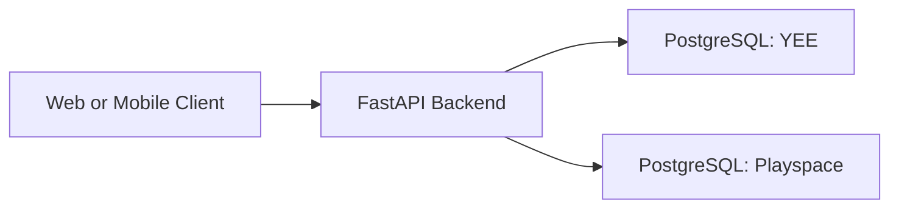

# Architecture

## Purpose

`audit-tools-backend` is one FastAPI service that hosts two product namespaces:

- `/yee/*`
- `/playspace/*`

Both products share the same codebase, but they do not currently share the same
auth contract.

## Runtime Topology

The application routes requests to one of two physical databases using the URL
prefix and product-aware session factories in `app/database.py`.

## Architectural Boundary

The repository is organized around a shared core plus product-specific modules:

- shared platform code in `app/`
- Playspace product logic in `app/products/playspace/`
- YEE product logic in `app/products/yee/` plus `app/yee_router.py`
- unified schema history in `alembic/versions/`

### Shared Core

Shared core is responsible for:

- database wiring
- shared ORM models
- shared route mounting
- shared auth helpers and token utilities
- seed orchestration

### YEE

YEE is the more complete product path today. It uses:

- `User` rows for auth identity
- email verification and approval state
- invite acceptance and onboarding
- YEE-specific submission, scoring, reporting, and export routes

### Playspace

Playspace now prefers the same signed `User` session model used by YEE:

- `/playspace/auth/signup`, `/playspace/auth/login`, and `/playspace/auth/me`
  create and return `User`-backed bearer sessions
- `app/products/playspace/routes/dependencies.py` resolves the current actor
  from that bearer session for the main product APIs
- `app/core/actors.py` retains `x-demo-*` parsing only as a temporary
  compatibility fallback when a request has no bearer token

## Major Modules

### `app/auth.py`

Owns the product-aware auth layer.

- YEE: full `User`-based signup, login, verification, invite acceptance, and session flows
- Playspace: immediate `User`-backed signup/login flows without the YEE email-verification step

### `app/models.py`

Defines:

- shared core entities such as `Account`, `Project`, `Place`, `AuditorProfile`, `Audit`
- shared auth entities such as `User`, plus YEE-specific invite entities such as `AuditorInvite`
- Playspace normalized audit tables

### `app/products/playspace/`

Owns:

- instrument metadata
- scoring logic
- audit draft and submit state
- dashboard and management services
- Playspace-specific seed generation

### `app/yee_router.py` and `app/dashboard_router.py`

Own the YEE-heavy routes for:

- auth-adjacent dashboard operations
- approvals
- reporting
- exports
- YEE submission workflows

## Core Request Flows

### YEE Auth

1. Client calls `/yee/auth/*`
2. `app/auth.py` resolves a YEE database session
3. Backend reads and writes `users`
4. Token-backed session routes use `get_current_user`

### Playspace Auth Bootstrap

1. Mobile client calls `/playspace/auth/signup` or `/playspace/auth/login`
2. Backend resolves the Playspace database
3. Playspace auth creates or loads a `User` linked to an `Account`
4. Mobile app stores that session locally
5. Subsequent Playspace product APIs resolve `CurrentUserContext` from the bearer token
6. If a legacy client omits the bearer token, the backend can still fall back to `x-demo-*` headers during transition

### Playspace Product APIs

1. Client calls `/playspace/*`
2. `app/products/playspace/routes/dependencies.py` resolves a Playspace DB session
3. Route dependencies derive the current actor from the signed `User` session when available
4. Services enforce account and auditor scope

## Design Rules

- Keep product-specific business logic under `app/products/<product>/`
- Keep schema and migration decisions aligned; merged code must not assume a
  column exists without a matching product migration
- Treat Playspace auth and YEE auth as separate contracts until the mobile app
  is migrated to a unified user-based model
- Keep route handlers thin and enforce business rules in services
- Preserve product-scoped migrations via `alembic -x product=...`

## Current Risks

- auth/schema drift between merged code and deployed databases
- documentation drift around `playspace` naming and env vars
- Playspace reliance on demo actor headers for core API authorization
- one-way compatibility migrations that require a careful deploy runbook

## Extension Guidance

When extending the repo:

- decide first whether the change is shared, YEE-specific, or Playspace-specific
- update docs and migrations in the same change when auth or schema behavior changes
- add at least one focused test for any product boundary you touch
- prefer explicit product branching over implicit shared behavior when the
  products still differ operationally
