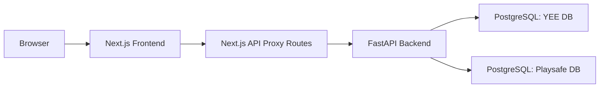

# Architecture

## Purpose

The Audit Tools platform is a multi-repo system for browser-based audit products. The YEE product is the most complete implementation in the current codebase.

The system is intentionally split into:

- a backend repo for data access, auth, business rules, scoring, and exports
- a frontend repo for routing, layouts, survey UI, and dashboard presentation

This separation keeps domain logic centralized in the backend and keeps the frontend focused on experience and workflow.

## Repository Layout

### Backend

- Path: `/Users/andishasafdariyan/auditTools/audit-tools-backend`
- Stack: FastAPI, SQLAlchemy async, Alembic, Strawberry GraphQL

Important files:

- [app/main.py](/Users/andishasafdariyan/auditTools/audit-tools-backend/app/main.py)
- [app/auth.py](/Users/andishasafdariyan/auditTools/audit-tools-backend/app/auth.py)
- [app/dashboard_router.py](/Users/andishasafdariyan/auditTools/audit-tools-backend/app/dashboard_router.py)
- [app/yee_router.py](/Users/andishasafdariyan/auditTools/audit-tools-backend/app/yee_router.py)
- [app/yee_scoring.py](/Users/andishasafdariyan/auditTools/audit-tools-backend/app/yee_scoring.py)
- [app/models.py](/Users/andishasafdariyan/auditTools/audit-tools-backend/app/models.py)

### Frontend

- Path: `/Users/andishasafdariyan/auditTools/audit-tools-yee-frontend`
- Stack: Next.js App Router, React, TypeScript, Tailwind, shadcn/ui

Important files:

- [src/app](/Users/andishasafdariyan/auditTools/audit-tools-yee-frontend/src/app)
- [src/components/auth](/Users/andishasafdariyan/auditTools/audit-tools-yee-frontend/src/components/auth)
- [src/components/dashboard](/Users/andishasafdariyan/auditTools/audit-tools-yee-frontend/src/components/dashboard)
- [src/components/yee](/Users/andishasafdariyan/auditTools/audit-tools-yee-frontend/src/components/yee)
- [src/components/reporting](/Users/andishasafdariyan/auditTools/audit-tools-yee-frontend/src/components/reporting)
- [src/lib/auth](/Users/andishasafdariyan/auditTools/audit-tools-yee-frontend/src/lib/auth)
- [src/lib/dashboard](/Users/andishasafdariyan/auditTools/audit-tools-yee-frontend/src/lib/dashboard)

## Runtime Topology

The frontend calls local API proxy routes. Those proxy routes call the backend using `API_BASE_URL`. This keeps browser-side code simpler and gives one place to normalize backend errors.

## Product Namespaces

The backend is product-scoped:

- `/yee/*`
- `/playsafe/*`

The current dashboard and audit management work is primarily implemented for the YEE namespace.

## Major Backend Domains

### Auth

Implemented in [app/auth.py](/Users/andishasafdariyan/auditTools/audit-tools-backend/app/auth.py).

Responsibilities:

- signup
- login
- email verification
- resend verification
- current session
- profile completion
- invite preview and invite acceptance
- role-aware response shaping

### Dashboard / Workspace

Implemented in [app/dashboard_router.py](/Users/andishasafdariyan/auditTools/audit-tools-backend/app/dashboard_router.py).

Responsibilities:

- overview metrics
- projects, places, auditors, audits
- admin users list and approval
- project/place detail views
- auditor invite creation
- assignment creation
- manager/admin reporting
- raw data export
- auditor assigned-place lookup

### YEE Survey

Implemented across:

- [app/yee_router.py](/Users/andishasafdariyan/auditTools/audit-tools-backend/app/yee_router.py)
- [app/yee_scoring.py](/Users/andishasafdariyan/auditTools/audit-tools-backend/app/yee_scoring.py)

Responsibilities:

- instrument loading
- score preview
- final submission
- submission retrieval
- auditor submission history

## Core Data Model

Key entities in [app/models.py](/Users/andishasafdariyan/auditTools/audit-tools-backend/app/models.py):

- `Account`
  - organization/workspace boundary
- `User`
  - auth identity and approval/profile state
- `Project`
  - groups places under an account
- `Place`
  - auditable physical location
- `Auditor`
  - profile with generated auditor code
- `AuditorInvite`
  - manager-issued invite for auditor onboarding
- `Assignment`
  - links an auditor to a place
- `Audit`
  - generic audit record used for reporting/activity
- `YeeAuditSubmission`
  - YEE-specific stored submission with participant info, responses, section scores, and total

## Request Flows

### Signup / Login

1. Frontend form posts to `/api/auth/signup` or `/api/auth/login`
2. Next.js proxy forwards to backend `/yee/auth/*`
3. Backend reads/writes YEE database
4. Backend returns role and onboarding state
5. Frontend routes to verification, waiting approval, profile completion, or dashboard

### Manager Setup

1. Manager creates project
2. Manager creates place
3. Manager invites auditor
4. Manager assigns auditor to place
5. Auditor can now see that place in `/my-dashboard`

### YEE Audit Submission

1. Auditor selects assigned place
2. Frontend loads instrument metadata
3. Auditor completes step-based survey
4. Frontend can call score preview
5. Frontend submits final audit to backend
6. Backend validates assignment and duplicate-submission rules
7. Backend stores `Audit` and `YeeAuditSubmission`
8. Dashboard reporting and export endpoints read from stored submissions

## Authorization Model

The frontend has route guards, but backend enforcement is the real security boundary.

Important examples:

- only admins can list all users or approve users
- managers are scoped to their `account_id`
- auditors can only access assigned places and their own submissions
- only one submitted YEE audit per auditor/place pair is allowed

## Current Limitations

- settings pages are not feature-complete
- admin lifecycle actions beyond approval are not implemented
- audit subset selection in comparison views is not fully implemented
- cap score logic is intentionally deferred

## Extension Guidance

When extending the system:

- put business rules in backend routes/services, not only in the frontend
- treat generated auditor IDs as the public/default reporting identity
- keep role logic centralized instead of scattering checks through many pages
- preserve product scoping so YEE and future products can coexist safely
