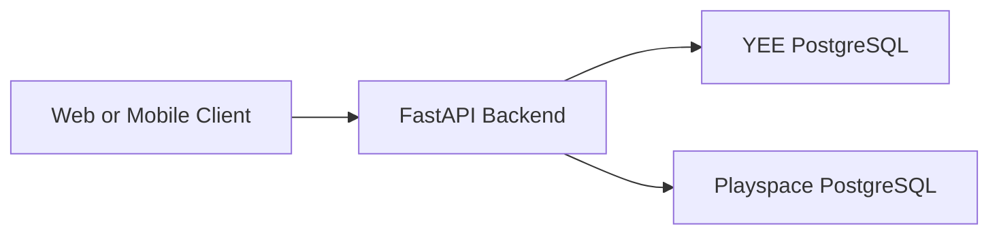

# Deployment

## Goal

Deploy one backend service that serves both product namespaces:

- `/yee/*`
- `/playspace/*`

The backend still talks to two separate PostgreSQL databases, one per product.

## Deployment Topology



## Required Infrastructure

Backend requirements:

- Python runtime
- ASGI host
- environment variable management
- network access to both product databases

Database requirements:

- one database for `yee`
- one database for `playspace`

The backend expects:

- `DATABASE_URL_YEE`
- `DATABASE_URL_PLAYSPACE`

## Backend Environment Variables

Required:

- `DATABASE_URL_YEE`
- `DATABASE_URL_PLAYSPACE`
- `AUTH_TOKEN_SECRET_KEY`

Recommended:

- `AUTH_ACCESS_TOKEN_TTL_DAYS`
- `AUTH_EMAIL_VERIFY_TTL_HOURS`
- `AUTH_VERIFY_URL_TEMPLATE`

Optional but important in production:

- `SMTP_HOST`
- `SMTP_PORT`
- `SMTP_USERNAME`
- `SMTP_PASSWORD`
- `SMTP_FROM_EMAIL`
- `SMTP_USE_TLS`
- `TURNSTILE_SECRET_KEY`

## Migration Runbook

The backend migration history is product-scoped. You must run Alembic once per
database:

```bash
alembic -x product=yee upgrade head
alembic -x product=playspace upgrade head
```

Important notes:

- do not assume a successful code deploy means both databases are migrated
- several compatibility migrations are one-way and should be treated as
  production operations
- back up both databases before applying migration batches in shared-core merge windows

## Render Note

The checked-in `render.yaml` installs dependencies and starts `uvicorn`, but it
does not itself guarantee that Alembic ran first.

If you deploy on Render, make sure your release process includes the two product
migration commands above, either through:

- a release/pre-deploy command
- a CI job that runs before traffic is shifted
- a manual runbook step

If you skip that step, merged code can reach production before the matching
schema exists.

## Production Checklist

1. Provision both PostgreSQL databases
2. Set all backend environment variables
3. Run `alembic -x product=yee upgrade head`
4. Run `alembic -x product=playspace upgrade head`
5. Start the backend service
6. Verify `/health`
7. Verify one YEE auth flow and one Playspace auth flow
8. Verify one YEE product flow and one Playspace product flow

## Verification Flow

YEE email verification requires:

- real SMTP delivery
- a valid `AUTH_VERIFY_URL_TEMPLATE`

Example:

```env
AUTH_VERIFY_URL_TEMPLATE=https://your-frontend-domain.example/verify-email?token={token}
```

## Suggested Release Validation

Minimum release smoke test:

- `GET /health`
- YEE login or invite acceptance
- Playspace login
- one YEE manager/admin dashboard call
- one Playspace dashboard or instrument call
- one migration status check per database

## Security Notes

- use a strong `AUTH_TOKEN_SECRET_KEY`
- use HTTPS for all public traffic
- never expose database credentials to client-side code
- keep authorization checks in backend services, not only in the UI
- prefer failing a deploy on migration mismatch over serving schema-drifted code
