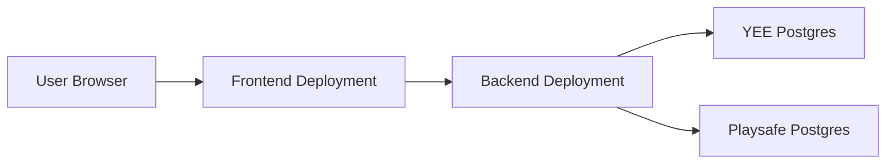

# Deployment

## Goal

Deploy the YEE platform as two separate services:

- frontend service
- backend service

The repositories should remain separate in deployment, just as they are in local development.

## Deployment Topology



## Required Services

### Backend

Needs:

- Python runtime
- ASGI-compatible host
- access to PostgreSQL databases
- environment variable management

### Frontend

Needs:

- Next.js-capable host
- environment variable management
- ability to call the backend over HTTPS

### Database

Needs:

- one database for YEE
- one database for Playsafe

The backend expects:

- `DATABASE_URL_YEE`
- `DATABASE_URL_PLAYSAFE`

## Backend Environment Variables

From [.env.example](/Users/andishasafdariyan/auditTools/audit-tools-backend/.env.example):

Required:

- `DATABASE_URL_YEE`
- `DATABASE_URL_PLAYSAFE`
- `AUTH_TOKEN_SECRET_KEY`

Recommended:

- `AUTH_ACCESS_TOKEN_TTL_DAYS`
- `AUTH_EMAIL_VERIFY_TTL_HOURS`
- `AUTH_VERIFY_URL_TEMPLATE`

Optional but important for production:

- `SMTP_HOST`
- `SMTP_PORT`
- `SMTP_USERNAME`
- `SMTP_PASSWORD`
- `SMTP_FROM_EMAIL`
- `SMTP_USE_TLS`
- `TURNSTILE_SECRET_KEY`

## Frontend Environment Variables

Required:

- `API_BASE_URL`
- `NEXT_PUBLIC_API_BASE_URL`

Typical value:

```env
API_BASE_URL=https://your-backend-domain.example
NEXT_PUBLIC_API_BASE_URL=https://your-backend-domain.example
```

## Production Checklist

### Backend

1. Provision PostgreSQL databases
2. Set all production environment variables
3. Run migrations:

```bash
alembic -x product=yee upgrade head
alembic -x product=playsafe upgrade head
```

4. Start the app with an ASGI server
5. Verify:
   - `/health`
   - auth endpoints
   - dashboard endpoints
   - YEE instrument endpoint

### Frontend

1. Set production backend URL env vars
2. Build the app:

```bash
npm run build
```

3. Deploy the Next.js application
4. Verify:
   - `/login`
   - `/signup`
   - `/admin`
   - `/dashboard`
   - `/my-dashboard`
   - `/yee/introduction`

## Demo / Review Links

For temporary stakeholder review:

- a local frontend can be exposed with `ngrok`
- this is good for short-term demos
- it is not stable enough for production or long-lived review access

Important behavior:

- the tunnel only works while the local machine and local processes are running
- if the laptop sleeps or the tunnel restarts, the public link changes or goes offline

## Verification Flow In Production

To avoid the confusing local-development verification experience:

- configure real SMTP delivery
- set `AUTH_VERIFY_URL_TEMPLATE` to the public frontend URL

Example:

```env
AUTH_VERIFY_URL_TEMPLATE=https://your-frontend-domain.example/verify-email?token={token}
```

This ensures users can click the verification link directly from email and land in the correct frontend screen.

## Security Notes

- set a strong `AUTH_TOKEN_SECRET_KEY`
- use HTTPS for frontend and backend
- do not expose raw database credentials in client-side env vars
- keep authorization checks in backend routes even if the frontend already hides UI
- keep generated auditor IDs as the default reporting identity

## Current Deployment Gaps

Before public launch, future engineers should still complete:

- final production email delivery configuration
- final settings/profile flows
- admin deny/revoke/deactivate lifecycle actions
- broader QA with seeded accounts and test data
- monitoring/logging decisions
- final review of privacy handling and export contents

## Suggested Release Validation

Minimum release test matrix:

- admin login and user approval
- manager signup, profile completion, project creation, place creation
- auditor invite accept, verification, profile completion
- auditor assignment visibility in `/my-dashboard`
- one successful YEE submission
- duplicate submission blocked for same auditor/place
- manager place comparison report loads
- raw data export downloads expected fields
