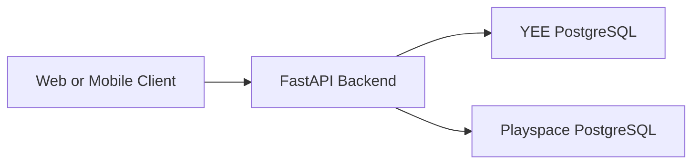

# Deployment

## Goal

Deploy one backend service that serves both product namespaces:

- `/yee/*`
- `/playspace/*`

The backend still talks to two separate PostgreSQL databases, one per product.

## Deployment Topology


```mermaid
flowchart LR
    Client["Web or Mobile Client"] --> Backend["FastAPI Backend"]
    Backend --> YEE_DB["YEE PostgreSQL"]
    Backend --> PLAYSPACE_DB["Playspace PostgreSQL"]
```

## Required Infrastructure

Backend requirements:

- Python runtime
- ASGI host
- environment variable management
- network access to both product databases

Database requirements:

- one database for `yee`
- one database for `playspace`

The backend expects:

- `DATABASE_URL_YEE`
- `DATABASE_URL_PLAYSPACE`

## Backend Environment Variables

Required:

- `DATABASE_URL_YEE`
- `DATABASE_URL_PLAYSPACE`
- `AUTH_TOKEN_SECRET_KEY`

Recommended:

- `AUTH_ACCESS_TOKEN_TTL_DAYS`
- `AUTH_EMAIL_VERIFY_TTL_HOURS`
- `AUTH_PASSWORD_RESET_TTL_HOURS`
- `AUTH_VERIFY_URL_TEMPLATE`
- `AUTH_PASSWORD_RESET_URL_TEMPLATE`
- `AUTH_INVITE_URL_TEMPLATE`
- `AUTH_MANAGER_INVITE_URL_TEMPLATE`

Optional but important in production:

- `GOOGLE_PLAY_SERVICE_ACCOUNT_JSON`
- `PLAYSPACE_GOOGLE_PLAY_TRACK`
- `YEE_GOOGLE_PLAY_TRACK`
- `PLAYSPACE_EAS_WEBHOOK_SECRET`
- `YEE_EAS_WEBHOOK_SECRET`
- `MOBILE_RELEASE_POLICY_GITHUB_TOKEN`
- `MOBILE_RELEASE_POLICY_CACHE_TTL_SECONDS`
- `SMTP_HOST`
- `SMTP_PORT`
- `SMTP_USERNAME`
- `SMTP_PASSWORD`
- `SMTP_FROM_EMAIL`
- `SMTP_USE_TLS`
- `BREVO_API_KEY`
- `BREVO_SENDER_EMAIL`
- `BREVO_SENDER_NAME`
- `BREVO_REPLY_TO_EMAIL`
- `ADMIN_NOTIFICATION_EMAIL`
- `TURNSTILE_SECRET_KEY`
- `PROTECTED_YEE_DEMO_EMAILS`

## Mobile Release Policy Sources

The public `/playspace/mobile-release-policy` and `/yee/mobile-release-policy`
routes keep `minimum_supported_version` and `minimum_supported_build` as backend
policy decisions. Latest release metadata resolves in this order:

1. Google Play Developer API for Android closed testing (`alpha` by default)
2. Signed EAS Build webhook metadata cached by the backend
3. Public GitHub `app.config.js`
4. Static last-known backend fallback values

`PLAYSPACE_GOOGLE_PLAY_TRACK` and `YEE_GOOGLE_PLAY_TRACK` can override the
default Google Play track name. For closed alpha testing, leave them unset or set
them to `alpha`.

### `minimum_supported_version` is a hand-maintained gate

Only `latest_version` is auto-resolved from the sources above. The
**`minimum_supported_version`** / `minimum_supported_build` values are backend
**policy constants**, hardcoded per product and platform in
`PLAYSPACE_RELEASE_POLICY` and `YEE_RELEASE_POLICY` in
`app/products/mobile_release_policy.py`. Clients below this floor are forced to
update, so it is a deliberate decision — never auto-derived from a store release.

**Review this floor on every mobile version bump.** Whenever either mobile app
(`copa-mobile` / COPA or `yee-mobile` / YEE) bumps its version — or an agent
finishes a mobile work session that ships to users — decide whether the floor
must rise for the matching product/platform block:

- **Raise it** when older installs would break or behave incorrectly against the
  current backend: a data/terminology migration, an offline-sync or contract
  change, a dropped/renamed API field, a required native capability, or a fix
  that older clients must not skip.
- **Leave it** for backward-compatible changes: theme/copy/i18n, minor UI, or
  additive changes older clients tolerate. Raising it needlessly force-updates
  users, so default to leaving it and justify any raise.

An agent wrapping up a mobile change must **evaluate and propose** the
new floor (or explicitly state "no change needed") with a one-line rationale, and
apply it only after the user confirms. The client-side trigger and post-task
convention live in the `mobile-version-bump` skill and each mobile app's README;
this file owns the backend policy itself.

### Supplying `GOOGLE_PLAY_SERVICE_ACCOUNT_JSON`

The Google Play API call authenticates with a service-account key (the JSON you
download from Google Cloud Console). The backend accepts it in two forms:

- **Inline JSON** - paste the entire contents of the key file as the env var
  value. Fine for local `.env` files; on some dashboards the multi-line JSON is
  awkward to paste.
- **File path** - set the value to a path that holds the JSON. On Render, add a
  **Secret File** (e.g. named `google-play-service-account.json`); Render mounts
  it at `/etc/secrets/google-play-service-account.json`. Then set
  `GOOGLE_PLAY_SERVICE_ACCOUNT_JSON=/etc/secrets/google-play-service-account.json`.

The resolver treats a value starting with `{` as inline JSON and otherwise reads
it as a file path (see `_load_google_service_account_json` in
`app/products/mobile_release_google.py`). If the variable is unset, the Google
Play source is skipped and release metadata falls back to the next source.

Configure EAS Build webhooks to POST to:

- `/playspace/mobile-release-policy/eas-webhook`
- `/yee/mobile-release-policy/eas-webhook`

Each webhook must use the matching product secret variable listed above.

## Migration Runbook

The backend migration history is product-scoped **and branched**. A shared
`core` base revision (`0001`) holds the tables common to both products, and two
branches descend from it:

- `playspace` branch - Playspace-only tables (`playspace_*`)
- `yee` branch - YEE-only tables (`yee_audit_submissions`)

Each physical database only ever advances along its own branch, so the YEE
database never receives `playspace_*` tables and the Playspace database never
receives `yee_*` tables. Target the product branch head (not the bare `head`,
which is ambiguous with two heads):

```bash
alembic -x product=yee upgrade yee@head
alembic -x product=playspace upgrade playspace@head
```

### One-time cutover from the pre-branch history

If a database was previously migrated under the old single linear history
(through the squashed `0002`), re-point it onto the branched revision IDs with a
**stamp** - this changes only the `alembic_version` bookkeeping and runs **no
DDL**, so existing data is untouched:

```bash
# Playspace PRODUCTION (real data - stamp only, never re-run DDL):
alembic -x product=playspace -x environment=production stamp --purge playspace@head

# YEE is reset-friendly (seed data only): drop/recreate the schema and rebuild:
alembic -x product=yee -x environment=development upgrade yee@head
```

After stamping, `alembic -x product=playspace ... current` should report
`ps_0002 (head)`, and future Playspace changes are normal additive migrations on
the `playspace` branch.

Important notes:

- do not assume a successful code deploy means both databases are migrated
- several compatibility migrations are one-way and should be treated as
  production operations
- back up both databases before applying migration batches in shared-core merge windows

## Render Note

The checked-in `render.yaml` installs dependencies, runs both product migrations
in its `preDeployCommand`, and then starts `uvicorn`:

```yaml
preDeployCommand: "alembic -x product=yee upgrade yee@head && alembic -x product=playspace upgrade playspace@head"
```

`preDeployCommand` runs after the build and before the new release receives
traffic, so on Render both databases are migrated automatically as part of every
deploy. Keep that command present whenever you edit `render.yaml`; removing it
lets merged code reach production before the matching schema exists.

The same `render.yaml` also defines an hourly `cron` service
(`audit-tools-stalled-submission-detector`) for the offline-durability
never-arrived detector. It needs `DATABASE_URL_PLAYSPACE` plus the email/Brevo
keys set in the Render dashboard (ideally a shared env group).

If you deploy somewhere other than Render, make sure your own release process
runs the two product migration commands above before traffic shifts, through:

- a release/pre-deploy command
- a CI job that runs before traffic is shifted
- a manual runbook step

## Production Checklist

1. Provision both PostgreSQL databases
2. Set all backend environment variables
3. Run `alembic -x product=yee upgrade yee@head`
4. Run `alembic -x product=playspace upgrade playspace@head`
5. Start the backend service
6. Verify `/health`
7. Verify one YEE auth flow and one Playspace auth flow
8. Verify one YEE product flow and one Playspace product flow

## Verification Flow

YEE email verification requires:

- real SMTP delivery
- a valid `AUTH_VERIFY_URL_TEMPLATE`

Example:

```env
AUTH_VERIFY_URL_TEMPLATE=https://your-frontend-domain.example/verify-email?token={token}
```

Password reset and invite acceptance should also point at the frontend domain:

```env
AUTH_PASSWORD_RESET_URL_TEMPLATE=https://your-frontend-domain.example/reset-password?token={token}
AUTH_INVITE_URL_TEMPLATE=https://your-frontend-domain.example/invite/{token}
AUTH_MANAGER_INVITE_URL_TEMPLATE=https://your-frontend-domain.example/manager-invite/{token}
```

If you leave those templates blank, the backend will try to infer the frontend
origin from the incoming request headers. That is convenient for local testing,
but setting the explicit templates is safer for production email links.

## Suggested Release Validation

Minimum release smoke test:

- `GET /health`
- YEE login or invite acceptance
- Playspace login
- one YEE manager/admin dashboard call
- one Playspace dashboard or instrument call
- one migration status check per database

If you intentionally keep seeded YEE demo accounts in a shared review/staging
environment, and one of those credentials drifts, you can restore the known
demo passwords without destructive reseeding:

```bash
python -m app.reset_demo_passwords
```

By default, the backend protects the built-in seeded YEE demo emails from
invite-based identity takeover and self-service password-reset drift. If you
need to customize that protected set for a deployment, configure
`PROTECTED_YEE_DEMO_EMAILS` as a comma-separated list.

## Security Notes

- use a strong `AUTH_TOKEN_SECRET_KEY`
- use HTTPS for all public traffic
- never expose database credentials to client-side code
- keep authorization checks in backend services, not only in the UI
- prefer failing a deploy on migration mismatch over serving schema-drifted code
